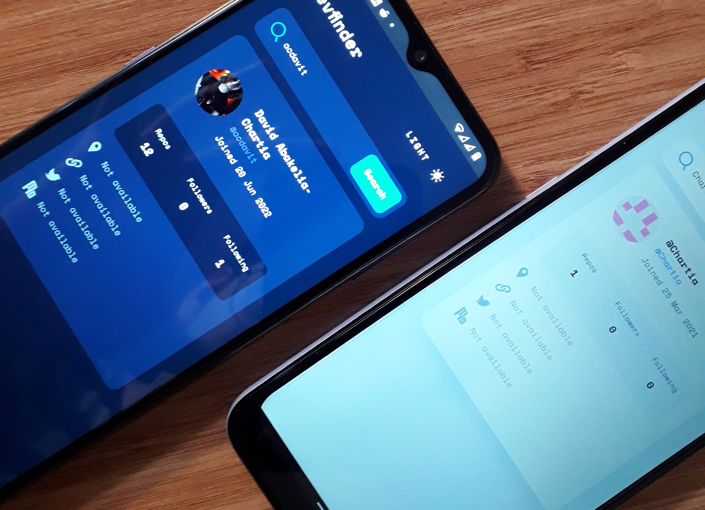
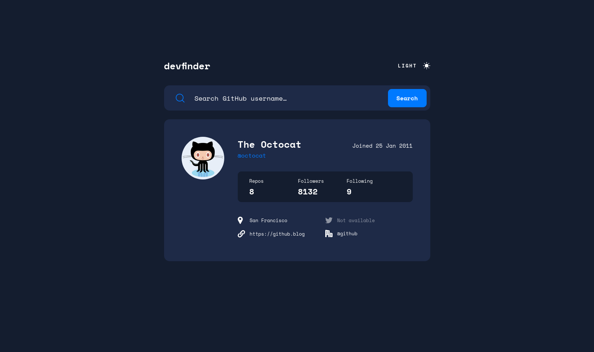

# Bitoid - GitHub user search app solution

This is a solution to the Github user search app on Bitoid
## Table of contents

- [Overview](#overview)
  - [The challenge](#the-challenge)
  - [Screenshots](#screenshots)
  - [Links](#links)
  - [Built with](#built-with)
- [Author](#author)

## Overview

### The challenge

Users should be able to:

- View the optimal layout for the app depending on their device's screen size
- See hover states for all interactive elements on the page
- Search for GitHub users by their username
- See relevant user information based on their search
- Switch between light and dark themes

### Screenshots

### Links

- Solution URL: [Add solution URL here](https://github.com/acdavit/github-user-search-app)
- Live Site URL: [Add live site URL here](https://github-user-search-app-acdavit.netlify.app/)

### Built with

- Semantic HTML5 markup
- CSS custom properties
- Flexbox
- CSS Grid
- Mobile-first workflow
- [React](https://reactjs.org/) - JS library
- [Next.js](https://nextjs.org/) - React framework

## Author

- LinkedIn - [David Abakelia-Chartia](https://www.linkedin.com/in/%E1%83%93%E1%83%90%E1%83%95%E1%83%98%E1%83%97-%E1%83%90%E1%83%91%E1%83%90%E1%83%99%E1%83%94%E1%83%9A%E1%83%98%E1%83%90-%E1%83%A9%E1%83%90%E1%83%A0%E1%83%A2%E1%83%98%E1%83%90-16a85524a/)
- GitHub - [@acdavit](https://github.com/acdavit)